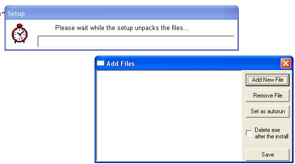



## Self Extract EXE

### Description

Did you ever want a self-extract exe? This program creates self extract exes. you can pack into one exe many files, at any size, and when you run the exe, the exe will extract the files.
 
### More Info
 

             |
---                |---
**Submitted On**   |2004-08-20 07:39:04
**By**             |[ «A\.R»](https://github.com/Planet-Source-Code/PSCIndex/blob/master/ByAuthor/a-r.md)
**Level**          |Advanced
**User Rating**    |4.9 (59 globes from 12 users)
**Compatibility**  |VB 6\.0
**Category**       |[Files/ File Controls/ Input/ Output](https://github.com/Planet-Source-Code/PSCIndex/blob/master/ByCategory/files-file-controls-input-output__1-3.md)
**World**          |[Visual Basic](https://github.com/Planet-Source-Code/PSCIndex/blob/master/ByWorld/visual-basic.md)
**Archive File**   |[Self\_Extra1783858202004\.zip](https://github.com/Planet-Source-Code/a-r-self-extract-exe__1-55688/archive/master.zip)

